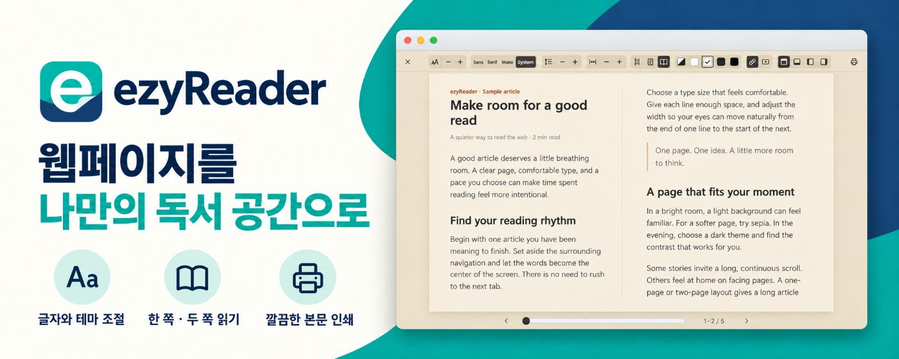

# ezyReader

웹페이지의 본문을 골라 나에게 편한 독서 화면으로 읽는 Chrome 확장 프로그램입니다.

A Chrome extension that turns web articles into a clean, customizable reading view.

[최신 릴리스 / Latest release](https://github.com/koprodev/ezyReader/releases/latest) · [개인정보처리방침 / Privacy policy](https://koprodev.github.io/ezyReader/privacy.html) · [지원 / Support](https://github.com/koprodev/ezyReader/issues)

## 주요 기능 / Features

- 아이콘·`Alt+Shift+R`·우클릭으로 페이지 또는 선택한 부분 읽기
- 글자 크기·글꼴·줄 간격·본문 폭 조절
- 밝게·세피아·어둡게·검정·자동 테마
- 스크롤·한 쪽·두 쪽 보기와 본문 인쇄
- 선택적으로 YouTube·X 삽입 미디어 표시
- 한국어·영어·일본어·스페인어·중국어 간체 지원

Read a page or selection, adjust typography and themes, switch between scrolling and one- or two-page layouts, and print the cleaned-up article. Optional YouTube and X embeds are off by default.

## 다운로드와 설치 / Download and install

Chrome 130 이상이 필요합니다. Chrome 웹 스토어 등록은 준비 중이며, 현재 GitHub 배포본은 아래 방법으로 설치할 수 있습니다.

1. [릴리스](https://github.com/koprodev/ezyReader/releases/latest)의 `ezyReader-0.1.9.zip`을 다운로드합니다.
2. ZIP을 별도 폴더에 압축 해제합니다.
3. Chrome의 `chrome://extensions`에서 **개발자 모드**를 켭니다.
4. **압축해제된 확장 프로그램을 로드합니다**를 누르고 `manifest.json`이 있는 폴더를 선택합니다.
5. 일반 웹페이지를 열고 ezyReader 아이콘 또는 `Alt+Shift+R`을 누릅니다.

Requires Chrome 130+. Download the extension ZIP from Releases, extract it, enable Developer mode at `chrome://extensions`, and choose **Load unpacked**. Select the folder containing `manifest.json`. The Chrome Web Store listing is being prepared.

Chrome 내부 페이지·웹 스토어·일부 보호된 페이지나 교차 출처 프레임에서는 읽기 화면을 사용할 수 없습니다. / Chrome internal pages, the Web Store, and some protected pages or cross-origin frames cannot be read.

## 개인정보 / Privacy

본문 추출과 표시는 브라우저 안에서 처리하며 개발자 서버로 보내지 않습니다. 설정은 기기에 저장합니다. Noto 글꼴은 Google Fonts에서, 본문 미디어는 원래 제공자에게서 불러옵니다. 시스템 글꼴을 선택하면 Google Fonts 요청을 하지 않습니다. YouTube·X는 삽입 미디어를 켠 경우에 요청합니다.

Article processing happens locally. No article content, page URLs, or settings are sent to a developer server. Fonts, original media, and optional embeds make requests to their respective providers. See the [full privacy policy](https://koprodev.github.io/ezyReader/privacy.html).

## 지원 / Support

[GitHub Issues](https://github.com/koprodev/ezyReader/issues)로 문의해 주세요. 공개 문의에 개인정보나 읽던 본문을 포함하지 마세요.

Please use GitHub Issues for support. Do not include personal information or article content in public issues.

배포 ZIP에는 Mozilla Readability와 DOMPurify의 라이선스 문서가 포함되어 있습니다. / The extension ZIP includes the license notices for Mozilla Readability and DOMPurify.
